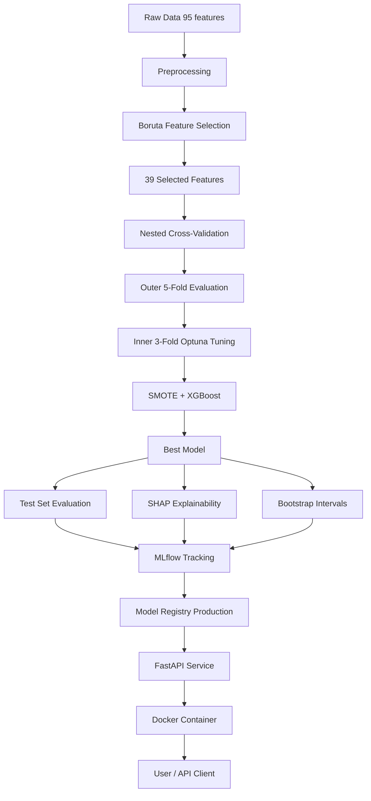
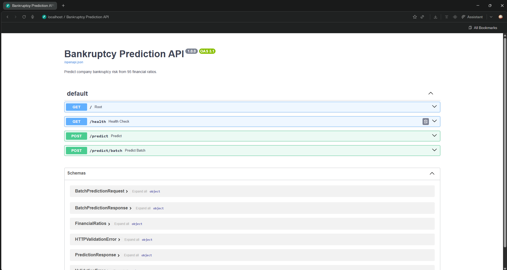
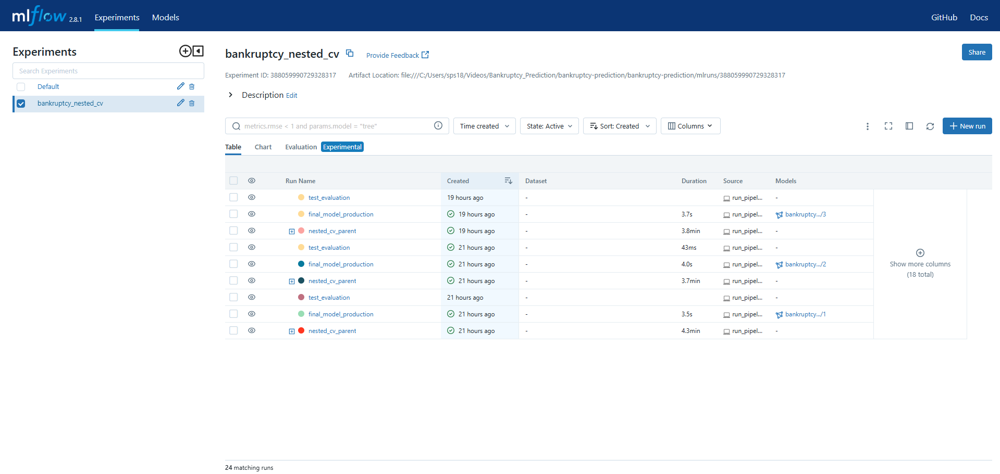
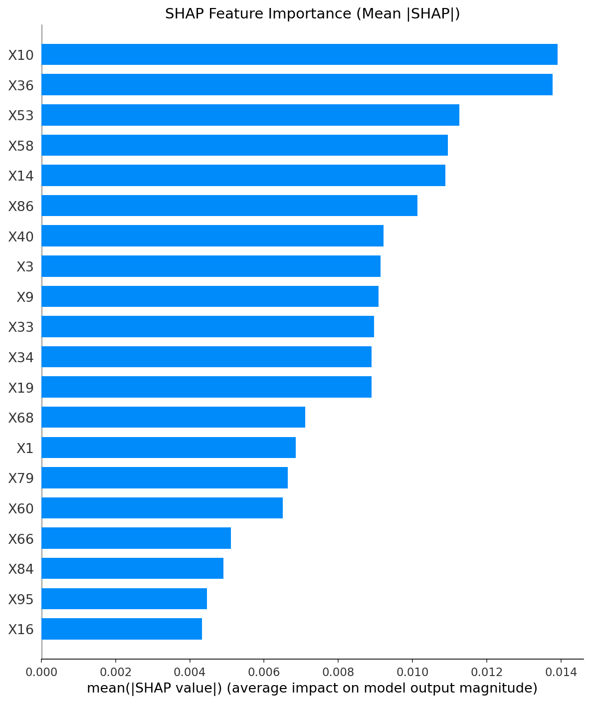
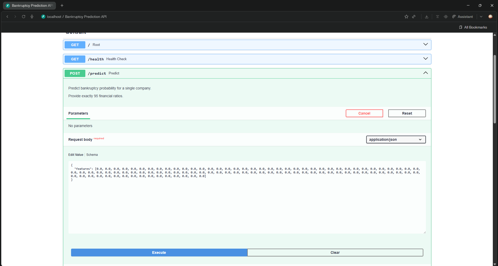
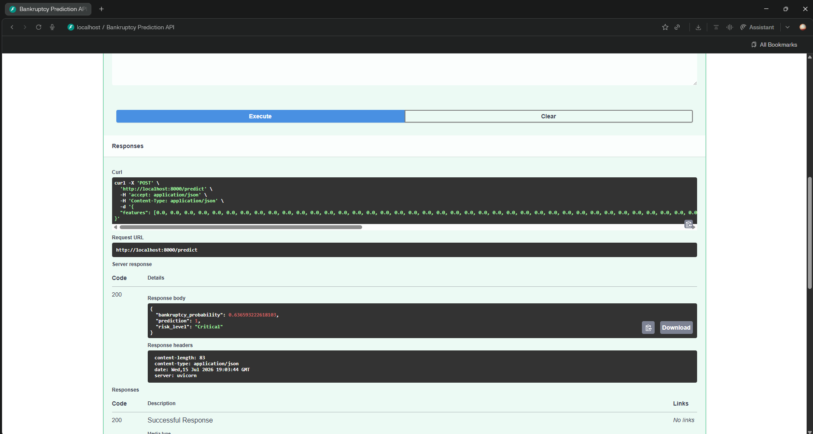
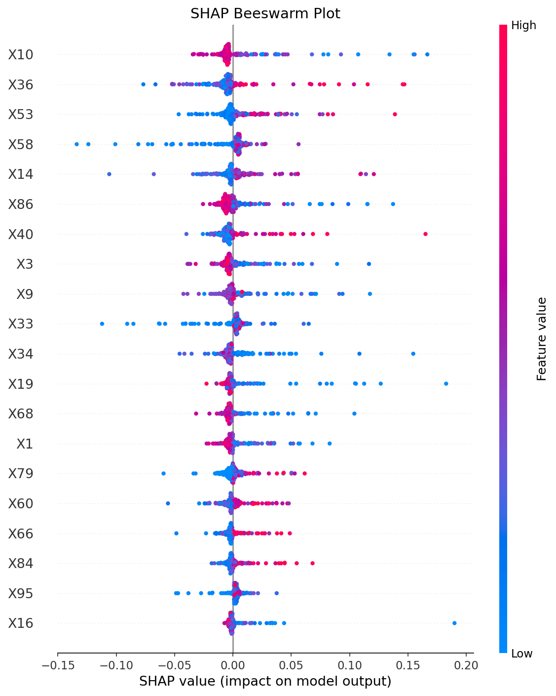
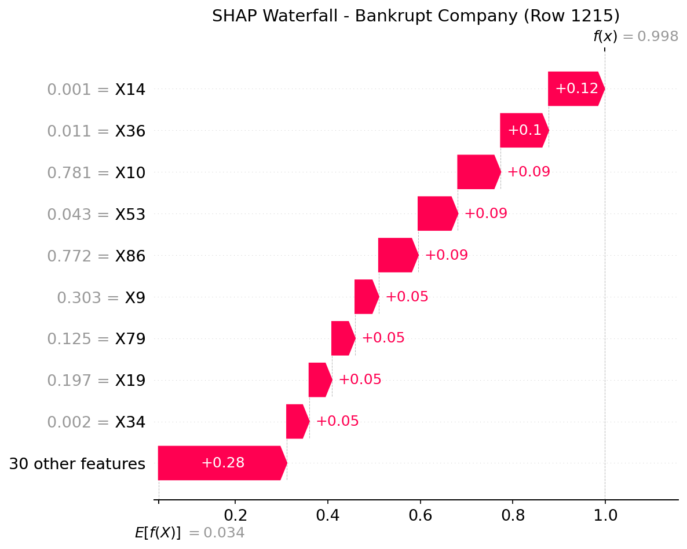

[](https://opensource.org/licenses/MIT)
[](https://www.python.org/downloads/release/python-3100/)
[](https://www.docker.com/)
[](https://mlflow.org/)
[](https://fastapi.tiangolo.com/)
[](https://xgboost.readthedocs.io/)

# 🏦 Bankruptcy Prediction Pipeline

End‑to‑end machine learning pipeline predicting **corporate bankruptcy** from 95 financial ratios.  
Built with **nested cross‑validation**, **SHAP explainability**, **MLflow experiment tracking**, and deployed as a **Dockerized FastAPI service**.

---

## 📌 Overview

Predicting bankruptcy is a critical task for financial institutions, auditors, and investors. This project tackles the **Taiwanese Bankruptcy Prediction** dataset — a heavily imbalanced real‑world problem where only **3.2%** of companies go bankrupt.

The pipeline demonstrates the complete **MLOps workflow**: from exploratory data analysis and robust model validation to deployment and containerisation.

---

## 📊 Dataset

- **Source:** [UCI Machine Learning Repository – Taiwanese Bankruptcy](https://archive.ics.uci.edu/dataset/572/taiwanese+bankruptcy+prediction)
- **Samples:** 6,819 companies
- **Features:** 95 financial ratios (profitability, liquidity, leverage, etc.)
- **Target:** `Bankrupt?` (0 = non‑bankrupt, 1 = bankrupt)
- **Imbalance:** 3.2% positive class (220 bankrupt vs 6,599 non‑bankrupt)

---

## 🧠 Approach

### Feature Selection
- **Boruta** algorithm — an all‑relevant feature selection method based on Random Forest.
- Reduced features from **95 → 39** (54 features rejected as noise).
- Selected features confirmed by multiple statistical tests against shadow features.

### Handling Class Imbalance
- **SMOTE** (Synthetic Minority Oversampling Technique) applied **only inside cross‑validation** to prevent data leakage.
- **XGBoost `scale_pos_weight`** adjusted to penalise misclassifications of the minority (bankrupt) class.
- Combined approach ensures robust minority class detection without overfitting.

### Model Validation
- **Nested Cross‑Validation** — outer 5‑fold for evaluation, inner 3‑fold for hyperparameter tuning.
- Provides **unbiased performance estimates** (single CV would give overly optimistic results).

### Hyperparameter Tuning
- **Optuna** — Bayesian optimisation with Tree‑Structured Parzen Estimator (TPE) sampler.
- 30 trials per fold, 50 trials for final model.
- Automatically prunes unpromising trials to save computation.

### Model
- **XGBoost** classifier — gradient‑boosted trees, state‑of‑the‑art for tabular data.
- Handles non‑linear relationships and feature interactions automatically.

### Explainability
- **SHAP** (SHapley Additive exPlanations) — model‑agnostic permutation explainer.
- Generates: **summary bar plot**, **beeswarm plot**, **waterfall plot**, **dependence plot**.
- **Bootstrap prediction intervals** (100 iterations) to quantify prediction uncertainty with 95% confidence intervals.

---

## 📈 Results

### Model Performance

| Metric | Value | Interpretation |
|--------|-------|----------------|
| **Nested CV AUC** | **0.936 ± 0.01** | Excellent discriminatory power across all data splits |
| **Hold‑out Test AUC** | **0.946** | Confirmed on unseen data |
| **Average Precision** | 0.579 | Good for highly imbalanced dataset |
| **Bankruptcy Recall** | **75%** | Catches 3 out of 4 true bankruptcies |
| **Precision** | 34% | Acceptable trade‑off in risk screening (false positives are less costly than missed bankruptcies) |
| **Accuracy** | 94% | But accuracy alone is misleading for imbalanced data |

### Confusion Matrix (Test Set — 1,364 companies)

| | Predicted Non‑Bankrupt | Predicted Bankrupt |
|---|---|---|
| **Actual Non‑Bankrupt** | 1,255 (TN) | 65 (FP) |
| **Actual Bankrupt** | 11 (FN) | 33 (TP) |

> 💡 **Business Impact:** The model correctly flags 33 of 44 bankrupt companies while only raising 65 false alarms. For a bank, catching 75% of potential defaults is extremely valuable, even with some false positives.

### Key Drivers of Bankruptcy (SHAP Analysis)

The top features influencing bankruptcy predictions are financial ratios related to:
- **Debt structure** and leverage
- **Cash flow** adequacy
- **Profitability** margins
- **Liquidity** ratios

---

## 🏗️ Project Architecture



### 🗂️ Project Structure

```text
├── app/                  # FastAPI application (endpoints, model loading, schemas)
├── src/                  # ML pipeline source code
├── models/               # Trained model and preprocessing artifacts (3 .pkl files)
├── reports/              # Generated SHAP plots and visualizations
├── screenshots/          # Demo images for documentation
├── data/raw/             # Original dataset (CSV)
├── Dockerfile            # Container configuration
├── requirements.txt      # Python dependencies
└── run_pipeline.py       # End‑to‑end orchestration script
```

---

## 🚀 Quick Start

### Prerequisites
- Python 3.10+ or Docker
- Git (to clone the repository)

### Option A: Run with Docker (Recommended)
```bash
# 1. Clone the repository
git clone https://github.com/tsar-king/bankruptcy-prediction.git
cd bankruptcy-prediction

# 2. Build the Docker image
docker build -t bankruptcy-api .

# 3. Run the container
docker run -p 8000:8000 bankruptcy-api

# 4. Open the API documentation
# Visit http://localhost:8000/docs in your browser
```

### Option B: Run Locally with Conda
```bash
# 1. Clone the repository
git clone https://github.com/tsar-king/bankruptcy-prediction.git
cd bankruptcy-prediction

# 2. Create and activate conda environment
conda create -n bankruptcy-ml python=3.10 -y
conda activate bankruptcy-ml

# 3. Install dependencies
pip install -r requirements.txt

# 4. Train the model (skip if you have models/*.pkl files)
python run_pipeline.py

# 5. Start the API server
uvicorn app.main:app --reload --port 8000

# 6. Open http://localhost:8000/docs
```

---

## 🔌 API Endpoints

| Method | Endpoint | Description | Auth |
|---|---|---|---|
| `GET` | `/` | Welcome message & service info | None |
| `GET` | `/health` | Health check (model loaded status) | None |
| `POST`| `/predict` | Predict bankruptcy for a single company | None |
| `POST`| `/predict/batch`| Predict for multiple companies at once | None |

### Sample Single Prediction
**Request:**
```json
{
  "features": [0.1, 0.2, 0.3, 0.4, 0.5, 0.6, 0.7, 0.8, 0.9, 1.0, 0.1, 0.2, 0.3, 0.4, 0.5, 0.6, 0.7, 0.8, 0.9, 1.0, 0.1, 0.2, 0.3, 0.4, 0.5, 0.6, 0.7, 0.8, 0.9, 1.0, 0.1, 0.2, 0.3, 0.4, 0.5, 0.6, 0.7, 0.8, 0.9, 1.0, 0.1, 0.2, 0.3, 0.4, 0.5, 0.6, 0.7, 0.8, 0.9, 1.0, 0.1, 0.2, 0.3, 0.4, 0.5, 0.6, 0.7, 0.8, 0.9, 1.0, 0.1, 0.2, 0.3, 0.4, 0.5, 0.6, 0.7, 0.8, 0.9, 1.0, 0.1, 0.2, 0.3, 0.4, 0.5, 0.6, 0.7, 0.8, 0.9, 1.0, 0.1, 0.2, 0.3, 0.4, 0.5, 0.6, 0.7, 0.8, 0.9, 1.0, 0.1, 0.2, 0.3, 0.4, 0.5, 0.6, 0.7, 0.8, 0.9]
}
```

**Response:**
```json
{
  "bankruptcy_probability": 0.0234,
  "prediction": 0,
  "risk_level": "Low"
}
```

### Sample Batch Prediction
**Request:**
```json
{
  "samples": [
    {"features": [0.1, 0.1, "... 95 values ..."]},
    {"features": [0.9, 0.9, "... 95 values ..."]}
  ]
}
```

**Response:**
```json
{
  "predictions": [
    {"bankruptcy_probability": 0.005, "prediction": 0, "risk_level": "Low"},
    {"bankruptcy_probability": 0.988, "prediction": 1, "risk_level": "Critical"}
  ]
}
```

### Risk Level Thresholds
| Probability Range | Risk Level |
|---|---|
| 0.0 – 0.1 | Low |
| 0.1 – 0.3 | Medium |
| 0.3 – 0.5 | High |
| 0.5 – 1.0 | Critical |

---

## 🧪 Reproducing Experiments with MLflow

The entire pipeline is tracked with MLflow for reproducibility.

```bash
# Start MLflow tracking server
mlflow ui --port 5000

# Open http://localhost:5000 in your browser
```

The experiment `bankruptcy_nested_cv` contains:
- Parent run with aggregated CV metrics
- 5 child runs (one per outer fold) with fold‑specific parameters and AUC scores
- Final production run with the registered model `bankruptcy_predictor` (v1, Stage: Production)

---

## 🐳 Docker

The project includes a production‑ready Docker configuration.

```bash
# Build the image
docker build -t bankruptcy-api .

# Run interactively
docker run -p 8000:8000 bankruptcy-api

# Run in detached mode
docker run -d -p 8000:8000 --name bankruptcy-api bankruptcy-api

# Stop the container
docker stop bankruptcy-api

# View logs
docker logs bankruptcy-api
```

The Docker image includes:
- Python 3.10 slim base (minimal attack surface)
- All Python dependencies pre‑installed
- Trained model files (ready to serve)
- FastAPI application with Uvicorn ASGI server

---

## 📸 Screenshots

| Swagger UI | MLflow Dashboard |
|:---:|:---:|
|  |  |

| SHAP Summary | Prediction Input |
|:---:|:---:|
|  |  | 

| Prediction Response |
|:---:|
| |

| Beeswarm Plot | Waterfall Plot |
|:---:|:---:|
|  |  |

*(Ensure these image paths match your actual repository structure!)*

---

## 🛠️ Tech Stack

| Category | Tools |
|---|---|
| **Language** | Python 3.10 |
| **ML Framework** | XGBoost, Scikit‑learn, Imbalanced‑learn |
| **Hyperparameter Tuning** | Optuna (Bayesian TPE sampler) |
| **Explainability** | SHAP (model‑agnostic permutation explainer) |
| **Experiment Tracking** | MLflow (tracking + model registry) |
| **API Framework** | FastAPI + Uvicorn |
| **Data Validation** | Pydantic |
| **Containerisation** | Docker |
| **Visualisation** | Matplotlib, SHAP plotting |
| **Data Manipulation** | Pandas, NumPy |

---

## 📚 Key Skills Demonstrated

- ✅ Severe class imbalance handling (SMOTE + scale_pos_weight, 3.2% positive rate)
- ✅ Nested cross‑validation for unbiased model evaluation
- ✅ Bayesian hyperparameter optimisation (Optuna with pruning)
- ✅ Feature selection (Boruta — all‑relevant method)
- ✅ Model explainability (SHAP plots + bootstrap prediction intervals)
- ✅ MLOps practices (MLflow experiment tracking & model registry)
- ✅ Production API deployment (FastAPI + Swagger UI)
- ✅ Containerisation (Docker with multi‑stage build)
- ✅ Input validation & error handling (Pydantic schemas, 422 responses)
- ✅ Reproducibility (fixed random seeds, versioned dependencies)

---

## 🤔 Why This Project Stands Out

- **Real‑world problem:** Bankruptcy prediction is directly applicable in banking, insurance, and audit.
- **Statistically rigorous:** Nested CV prevents the common mistake of optimistic bias.
- **Production‑ready:** The API can be deployed to any cloud platform (AWS, GCP, Azure) with zero code changes.
- **Fully documented:** Every function has docstrings, every design decision is explained.

---

## 📄 License
This project is licensed under the MIT License — see the [LICENSE](LICENSE) file for details.

---

## 👤 Author
**Shubhanshu**  
M.Tech in AI & Data Science  

[](https://www.linkedin.com/in/sps181098/)  
[](https://github.com/tsar-king)

---

⭐ **Star This Repository**  
If you find this project helpful or interesting, please consider giving it a star ⭐ — it helps others discover it too!
